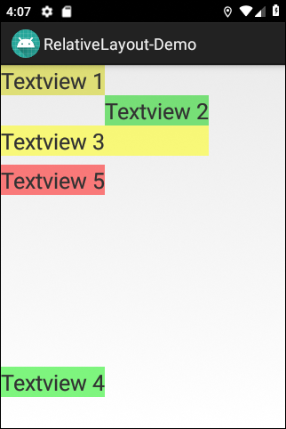

# Android-App "RelativeLayout-Demo" #

 

Android app to demonstrate how the [RelativeLayout](https://developer.android.com/reference/android/widget/RelativeLayout) works.

 

App contains several layout files, which can be "activated" by commenting in/out
the corresponding statements in file
[MainActivity.java](app/src/main/java/de/mide/relativelayoutdemo/MainActivity.java).

 

Identifiers (names for classes, variables and methods), UI texts and (JavaDoc) comments are in German only.

 

----

## Screenshots ##

 

 

----

## License ##

 

See the [LICENSE file](LICENSE.md) for license rights and limitations (BSD 3-Clause License).

 
